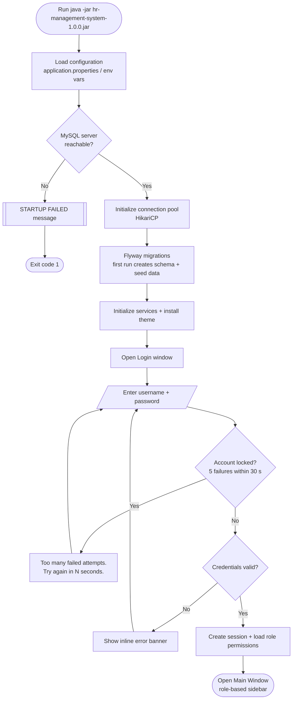
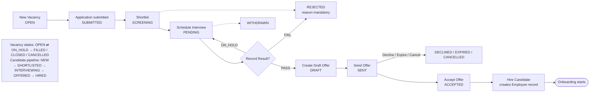
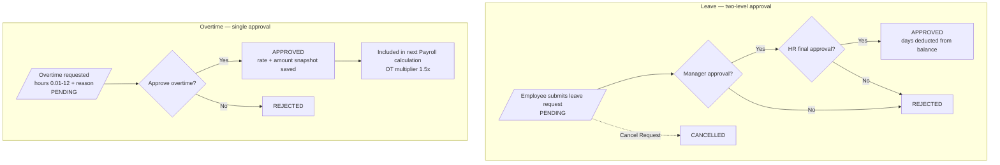
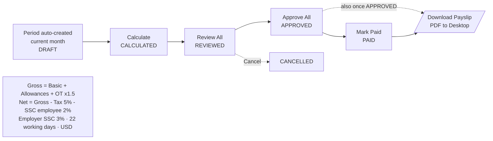
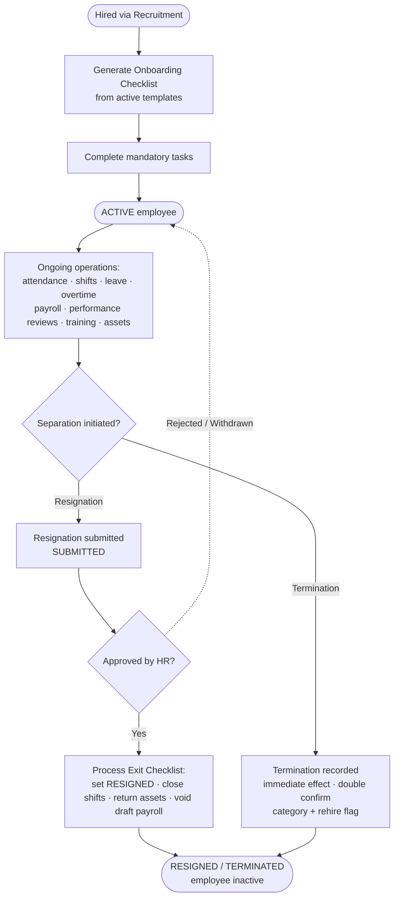
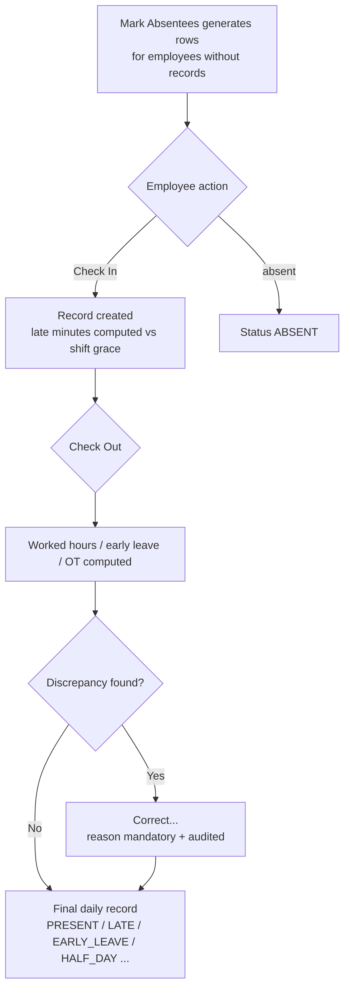

# HR Management System — Flowcharts

> Open `FLOWCHARTS.drawio` at [app.diagrams.net](https://app.diagrams.net) or with the
> draw.io VS Code extension for the full editable diagrams.
> The Mermaid versions below render directly on GitHub/GitLab and in many Markdown viewers.

---

## 1. Application Startup & Login

---

## 2. Recruitment Workflow

---

## 3. Leave Approval (two-level) & Overtime Approval

**Seeded leave types:** Annual 18 (carry-forward max 5) · Sick 14 · Casual 7 · Maternity 90 (F) · Paternity 15 (M) · Unpaid 30 · Other 5

---

## 4. Payroll Lifecycle

---

## 5. Employee Lifecycle (Hire to Separation)

---

## 6. Attendance Daily Cycle

